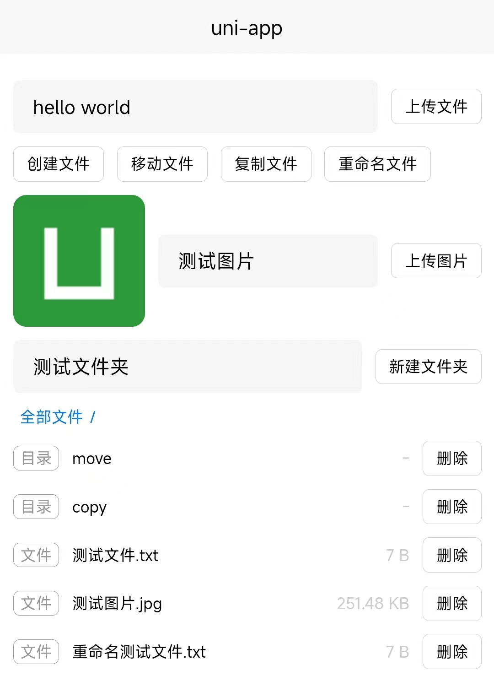

## 基于 plus 的 uni-app 文件系统

基于 [HTML 5 plus](https://www.html5plus.org/doc/h5p.html) 封装文件系统管理器，支持`读取`、`写入`、`删除`、`移动`、`复制`文件以及文件夹等操作

### 安装

```bash
# npm
npm install uni-plus-fs
```

```bash
# yarn
yarn add uni-plus-fs
```

```bash
# pnpm
pnpm install uni-plus-fs
```

### 注意

- 文件系统通过目录类型或者路径创建，文件根目录类型仅支持 `PRIVATE_WWW`、`PRIVATE_DOC`、`PUBLIC_DOCUMENTS`、 `PUBLIC_DOWNLOADS`，通过路径创建可能由于权限不够无法访问

- 文件读取或写入时，请确认文件所在目录是否创建，格式仅支持 `text`、`base64`

### 示例

示例参考 `./example` 文件夹，使用 `uni-plus-fs` 管理本地文件系统



### API

#### 文件管理器

- 根目录类型创建

  ```ts
  import { createFileSystemManager, IFileRootType } from 'uni-plus-fs'

  const fs = await createFileSystemManager({
    type: IFileRootType.PRIVATE_DOC
  })
  ```

- 路径创建

  ```ts
  import { createFileSystemManager } from 'uni-plus-fs'

  const fs = await createFileSystemManager({
    path: '/storage/emulated/0/Download'
  })
  ```

#### 文件操作

- 读取文件

  ```ts
  // 读取为文本
  const fileText = await fs.readFile('a.txt', 'text')

  // 读取为 base64
  const fileBase64 = await fs.readFile('a.txt', 'base64')
  ```

- 写入文件

  ```ts
  // 写入文本
  await fs.writeFile('a.txt', 'hello world', 'text')

  // 写入 base64
  await fs.writeFile('a.png', 'data:image/png;base64,...', 'base64')
  ```

- 删除文件

  ```ts
  await fs.removeFile('a.txt')
  ```

- 移动文件

  ```ts
  // 普通移动
  await fs.moveFile('a.txt', 'b.txt')

  // 覆盖移动
  await fs.moveFile('a.txt', 'b.txt', {
    /**
     * 是否创建对象标记
     * 指示如果文件或目录不存在时是否进行创建，默认值为false。
     */
    create: true,
    /**
     * 反向操作标记
     * 其本身没有任何效果，需与create属性值设置为true时一起使用，如果目标文件或目录已经存在则会导致文件或目录打开失败，默认值为false。
     */
    exclusive: false
    /**
     * 是否覆盖现有文件或目录
     */
    force: true
  })
  ```

- 复制文件

  ```ts
  // 普通复制
  await fs.copyFile('a.txt', 'b.txt')

  // 覆盖复制
  await fs.copyFile('a.txt', 'b.txt', {
    /**
     * 是否创建对象标记
     * 指示如果文件或目录不存在时是否进行创建，默认值为false。
     */
    create: true,
    /**
     * 反向操作标记
     * 其本身没有任何效果，需与create属性值设置为true时一起使用，如果目标文件或目录已经存在则会导致文件或目录打开失败，默认值为false。
     */
    exclusive: false
    /**
     * 是否覆盖现有文件或目录
     */
    force: true
  })
  ```

- 获取文件操作对象

  ```ts
  const entry = await fs.getFileEntry('a.txt', {
    /**
     * 是否创建对象标记
     * 指示如果文件或目录不存在时是否进行创建，默认值为false。
     */
    create: false,
    /**
     * 反向操作标记
     * 其本身没有任何效果，需与create属性值设置为true时一起使用，如果目标文件或目录已经存在则会导致文件或目录打开失败，默认值为false。
     */
    exclusive: false
  })
  ```

#### 文件夹操作

- 创建文件夹

  ```ts
  await fs.createDirectory('a')
  ```

- 删除文件夹

  ```ts
  // 普通删除
  await fs.removeDirectory('a')

  // 递归删除
  await fs.removeDirectory('a', true)
  ```

- 读取文件夹

  ```ts
  const entries = await fs.readDirectory('a')
  ```

- 复制文件夹

  ```ts
  // 普通复制
  await fs.copyDirectory('a', 'b')

  // 覆盖复制
  await fs.copyDirectory('a', 'b',{
    /**
     * 是否创建对象标记
     * 指示如果文件或目录不存在时是否进行创建，默认值为false。
     */
    create: true,
    /**
     * 反向操作标记
     * 其本身没有任何效果，需与create属性值设置为true时一起使用，如果目标文件或目录已经存在则会导致文件或目录打开失败，默认值为false。
     */
    exclusive: false
    /**
     * 是否覆盖现有文件或目录
     */
    force: true
  })
  ```

- 移动文件夹

  ```ts
  // 普通移动
  await fs.moveDirectory('a', 'b')

  // 覆盖移动
  await fs.moveDirectory('a', 'b',{
    /**
     * 是否创建对象标记
     * 指示如果文件或目录不存在时是否进行创建，默认值为false。
     */
    create: true,
    /**
     * 反向操作标记
     * 其本身没有任何效果，需与create属性值设置为true时一起使用，如果目标文件或目录已经存在则会导致文件或目录打开失败，默认值为false。
     */
    exclusive: false
    /**
     * 是否覆盖现有文件或目录
     */
    force: true
  })
  ```

- 获取文件夹操作对象

  ```ts
  const entry = await fs.getDirectoryEntry('a', {
    /**
     * 是否创建对象标记
     * 指示如果文件或目录不存在时是否进行创建，默认值为false。
     */
    create: false,
    /**
     * 反向操作标记
     * 其本身没有任何效果，需与create属性值设置为true时一起使用，如果目标文件或目录已经存在则会导致文件或目录打开失败，默认值为false。
     */
    exclusive: false
  })
  ```

#### 操作对象

- 获取文件系统操作对象

  ```ts
  import { getFileSystemEntry, IFileRootType } from 'uni-plus-fs'

  const entry = await getFileSystemEntry({
    type: IFileRootType.PRIVATE_DOC
  })
  ```

- 获取本地文件操作对象

  ```ts
  import { getLocalEntry } from 'uni-plus-fs'

  const entry = await getLocalEntry('/storage/emulated/0/Download')
  ```

- 获取文件根目录操作对象

  ```ts
  import { getFileRootEntry, IFileRootType } from 'uni-plus-fs'

  // 根目录类型
  const root = await getFileRootEntry({
    type: IFileRootType.PRIVATE_DOC
  })

  // 路径类型
  const root = await getFileRootEntry({
    path: '/storage/emulated/0/Download'
  })
  ```

- 获取父文件夹操作对象

  ```ts
  import { getParentEntry } from 'uni-plus-fs'

  const parentEntry = await getParentEntry(entry)
  ```

- 获取文件夹操作对象

  ```ts
  import { getDirectoryEntry } from 'uni-plus-fs'

  const entry = await getDirectoryEntry(parentEntry, 'a', {
    /**
     * 是否创建对象标记
     * 指示如果文件或目录不存在时是否进行创建，默认值为false。
     */
    create: false,
    /**
     * 反向操作标记
     * 其本身没有任何效果，需与create属性值设置为true时一起使用，如果目标文件或目录已经存在则会导致文件或目录打开失败，默认值为false。
     */
    exclusive: false
  })
  ```

- 获取文件操作对象

  ```ts
  import { getFileEntry } from 'uni-plus-fs'

  const entry = await getFileEntry(parentEntry, 'a.txt', {
    /**
     * 是否创建对象标记
     * 指示如果文件或目录不存在时是否进行创建，默认值为false。
     */
    create: false,
    /**
     * 反向操作标记
     * 其本身没有任何效果，需与create属性值设置为true时一起使用，如果目标文件或目录已经存在则会导致文件或目录打开失败，默认值为false。
     */
    exclusive: false
  })
  ```

- 读取文件操作对象

  ```ts
  import { readFileEntry } from 'uni-plus-fs'

  // 读取为文本
  const fileText = await readFileEntry(entry, 'text')

  // 读取为 base64
  const fileBase64 = await readFileEntry(entry, 'base64')
  ```

- 写入文件操作对象

  ```ts
  import { writeFileEntry } from 'uni-plus-fs'

  // 写入文本
  await writeFileEntry(entry, 'hello world', 'text')

  // 写入 base64
  await writeFileEntry(entry, 'data:image/png;base64,...', 'base64')
  ```

- 移动文件/文件夹操作对象

  ```ts
  import { moveEntry } from 'uni-plus-fs'

  // 普通移动
  await moveEntry(srcEntry, destEntry)

  // 覆盖移动
  await moveEntry(srcEntry, destEntry, {
    /**
     * 是否创建对象标记
     * 指示如果文件或目录不存在时是否进行创建，默认值为false。
     */
    create: true,
    /**
     * 反向操作标记
     * 其本身没有任何效果，需与create属性值设置为true时一起使用，如果目标文件或目录已经存在则会导致文件或目录打开失败，默认值为false。
     */
    exclusive: false
    /**
     * 是否覆盖现有文件或目录
     */
    force: true
  })
  ```

- 复制文件/文件夹操作对象

  ```ts
  import { copyEntry } from 'uni-plus-fs'

  // 普通复制
  await copyEntry(srcEntry, destEntry)

  // 覆盖复制
  await copyEntry(srcEntry, destEntry, {
    /**
     * 是否创建对象标记
     * 指示如果文件或目录不存在时是否进行创建，默认值为false。
     */
    create: true,
    /**
     * 反向操作标记
     * 其本身没有任何效果，需与create属性值设置为true时一起使用，如果目标文件或目录已经存在则会导致文件或目录打开失败，默认值为false。
     */
    exclusive: false
    /**
     * 是否覆盖现有文件或目录
     */
    force: true
  })
  ```

- 删除文件操作对象

  ```ts
  import { removeFileEntry } from 'uni-plus-fs'

  await removeFileEntry(entry)
  ```

- 删除文件夹操作对象

  ```ts
  import { removeDirectoryEntry } from 'uni-plus-fs'

  // 普通删除
  await removeDirectoryEntry(entry)

  // 递归删除
  await removeDirectoryEntry(entry, true)
  ```

- 获取文件操作对象信息

  ```ts
  import { getFileEntryInfo } from 'uni-plus-fs'

  const info = await getFileEntryInfo(entry)
  ```

- 获取文件夹操作对象信息

  ```ts
  import { getDirectoryEntryInfo } from 'uni-plus-fs'

  // 获取文件信息
  const info = await getDirectoryEntryInfo(entry)

  // 递归获取文件信息
  const info = await getDirectoryEntryInfo(entry, true)
  ```
